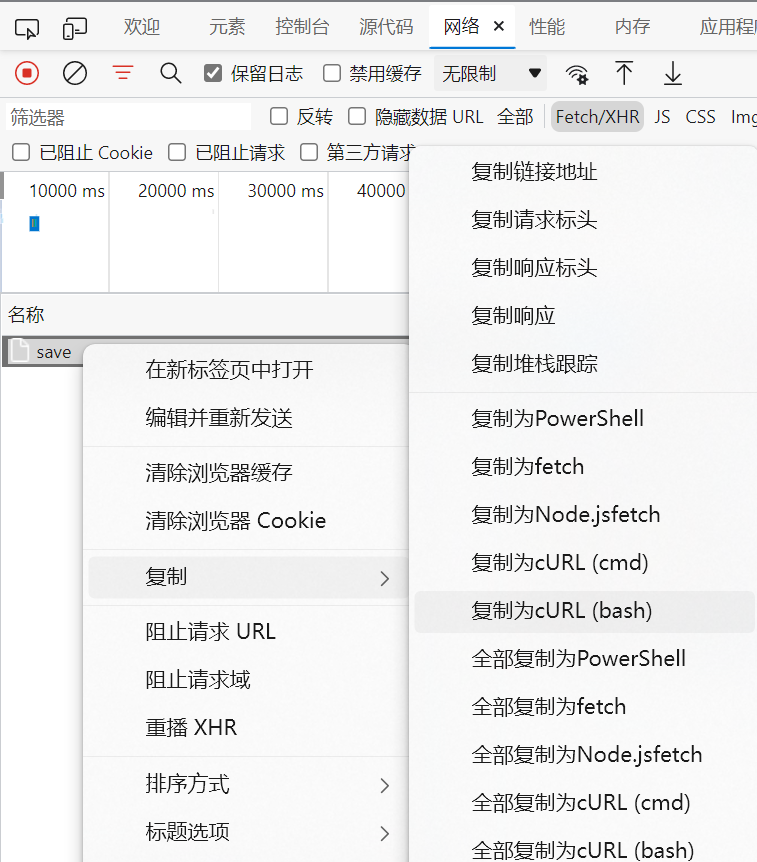

# HITSZ-DailyReport

>本脚本仅用作学习交流。

一个实现定时上报疫情信息的bash脚本。

## 初始配置

1. 将`DailyReport.sh`和`configure`放在同一目录下；

2. 给`DailyReport.sh`执行权限：`chmod +x DailyReport.sh`；

3. 按样例认真填写填写`configure`文件；

4. 运行`./DailyReport.sh`，若输出类似

   `[2022/03/13-20:40:04]:{"isSuccess":true,"module":"1","msg":""}`

   的信息则证明脚本成功运行。


## 脚本运行

推荐使用ubuntu-server已经内置的crontab进行脚本的定时运行。

第一次运行crontab时，在命令行输入`crontab -e`编辑crontab的配置文件来添加作业。

输入命令后可以选择一种编辑方式，在末尾写入

```
0 */6 * * * cd /your/path/to/DailyReport && ./DailyReport.sh >> ./log 2>&1
```

（cd的目录是`DailyReport.sh`和`configure`文件所在的目录)

保存退出后重启crontab：

```
service cron restart
```

即可实现每六小时填报一次，并将结果写入到`log`文件中（和上面两个文件在同一目录）。

## 修改未在配置文件中的上报信息

配置文件中可修改的条目并不是上报信息的全部，用户也可以自己定义其他未出现的上报条目

首先打开疫情上报的页面，填好所需上报的内容。

随后按<kbd>F12</kbd>打开开发者工具，然后再点击提交。在开发工具的网络项中找到save项，并复制为cURL(bash):

<div align="center"></div>

复制下来的内容中的`--data-raw`一项即为提交的内容。

只需将其中token对应的内容（最后两个%22中间的部分）替换为`$token`，然后整体填入DailReport.sh第172行的双引号之间即可。